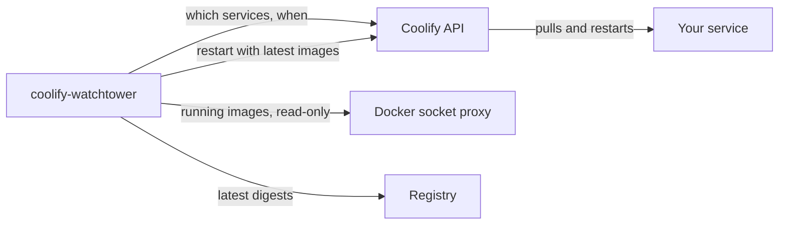

<p align="center">
  
</p>

<h1 align="center">coolify-watchtower</h1>

<p align="center">Automatic image updates for your Coolify services, carried out by Coolify itself.</p>

<p align="center">
  <a href="https://github.com/KimTholstorf/coolify-watchtower/actions/workflows/image.yml"></a>
  <a href="https://hub.docker.com/r/kimtholstorf/coolify-watchtower"></a>
</p>

coolify-watchtower checks the images of the services you choose, on a schedule you set per service. When a registry has a newer image, it asks Coolify to restart that service with the latest image. Coolify does the update, so it lands in the service's deployment history like any other deployment.

## Why not Watchtower?

Watchtower replaces containers behind Coolify's back. Coolify never learns about the update, Watchtower handles single containers rather than compose stacks, and it needs write access to the Docker socket.

coolify-watchtower only reads from Docker. Every change goes through Coolify's API.

## How it works

1. You opt a service in with a scheduled task or a label, and give it a schedule.
2. When the schedule is due, coolify-watchtower compares each running image with the registry.
3. If an image changed, it asks Coolify to restart the service with the latest images. If nothing changed, it does nothing.
4. It logs the result and can notify you on Discord or ntfy.



## Quick start

### 1. Create an API token

In Coolify's settings, set **API access** to Enabled (under API and MCP). Then create a token under **Keys & Tokens → API tokens** with the `read` and `deploy` permissions. You must be an admin or owner of the team, because Coolify rejects `deploy` tokens from ordinary members.

<!-- screenshot: token creation with read + deploy ticked -->

### 2. Deploy coolify-watchtower

1. Go to **+ New Resource → Docker Compose (empty)** and paste [`docker-compose.yml`](docker-compose.yml).
2. Leave **Connect to Predefined Network** off. The compose file already connects the right container to Coolify.
3. Under **Environment Variables**, set `COOLIFY_TOKEN` to your token. Everything else has a default.
4. Deploy. After a minute or two the status should read **Running (healthy)**.

### 3. Opt a service in

Open a service you want kept up to date, go to **Scheduled Tasks → New**, and enter:

| Field | Value |
|---|---|
| Name | `auto-update` |
| Command | `true` |
| Frequency | `30 4 * * *`, or `daily`, `weekly` |
| Container | any container in the service that has `sh` |

<!-- screenshot: the auto-update scheduled task on a service -->

### 4. Check the logs

Open coolify-watchtower's logs. Within a minute you'll see your service in the table, and at the scheduled time the result of each check:

```text
coolify-watchtower 1.6.1 | coolify=http://coolify:8080 ... tz=from Coolify servers dry_run=False
Coolify API OK (version 4.3.23)
Docker (socket proxy) OK
Services with 'auto-update' task or 'coolify.auto-update' label:
    coolify-watchtower  enabled   self   daily           Europe/Copenhagen   udgv5xuy2niy...
    my-app              enabled   task   30 4 * * *      Europe/Copenhagen   c92huq7by0wp...
[my-app] app-c92huq7by0wp...: mauriceboe/trek:latest UPDATE 4.3.1 -> 4.3.3 (819bee7d6b15 -> 1ef1ccf41af8)
[my-app] update available (report only, no restart)
Startup report done. Waiting for schedules.
```

The check at startup only reports. Updates happen at the scheduled times.

## Opting services in

There are two ways. Use whichever suits the service.

| | Scheduled task | Label |
|---|---|---|
| Where | the service's Scheduled Tasks tab | the service's compose file |
| Change the schedule | edit the task, takes effect within a minute | edit the label, then redeploy the service |
| Pause | switch the task off | set the label to `false` |
| Needs a shell in the container | yes, to run `true` | no |

A label looks like this and goes on any container in the service:

```yaml
labels:
  - coolify.auto-update=30 4 * * *
```

Its value is a schedule, `true` for the default schedule (`daily`), or `false` to pause. If a service has both a task and a label, the task wins.

Schedules are five-field cron expressions (numbers, `*`, ranges, lists and steps) or Coolify's words `hourly`, `daily`, `weekly`, `monthly` and `yearly`. They run in the timezone set for the server in Coolify (**Servers → General → Server Timezone**), the same as Coolify's own scheduled tasks.

> [!TIP]
> Coolify runs the `true` task at every scheduled time and may post "Scheduled task succeeded" to your notification channel each time. To keep the channel quiet, turn off the success notification for scheduled tasks under **Notifications** in Coolify, and keep the one for failures.

## Settings

Only `COOLIFY_TOKEN` is required.

| Variable | Default | What it does |
|---|---|---|
| `COOLIFY_TOKEN` | | API token with `read` and `deploy` |
| `NOTIFY_URL` | | Discord webhook or ntfy topic to notify, see [Notifications](#notifications) |
| `DRY_RUN` | `false` | `true` reports available updates without restarting anything |
| `SELF_UPDATE` | `daily` | when coolify-watchtower updates itself: a schedule, or `false` |
| `TZ` | | leave empty to use each server's timezone from Coolify, or set one timezone for everything |
| `COOLIFY_URL` | `http://coolify:8080` | Coolify's API address |
| `TASK_NAME` | `auto-update` | name of the scheduled task that opts a service in |
| `AUTO_UPDATE_LABEL` | `coolify.auto-update` | name of the label that opts a service in |
| `DEFAULT_SCHEDULE` | `daily` | schedule used when a label is set to `true` |
| `REPORT_ON_START` | `true` | check all opted-in services once at startup, report only |

## Notifications

Set `NOTIFY_URL` and you get a message when an update is started, when a restart fails (with Coolify's reason), and, in dry-run mode, when an update is available.

```text
coolify-watchtower: updating my-app
mauriceboe/trek:latest 4.3.1 -> 4.3.3
```

- **Discord:** create a webhook in the channel (**Channel settings → Integrations → Webhooks**) and use its URL. Coolify's API can't post to the Discord channel you set up inside Coolify, so coolify-watchtower needs its own webhook.
- **ntfy:** use the topic URL, e.g. `https://ntfy.sh/my-topic`.
- **Anything else:** coolify-watchtower sends a plain-text POST with the title in a `Title` header.

<!-- screenshot: a Discord notification -->

Versions such as `4.3.1 -> 4.3.3` come from the registry's tags. When no version tag matches an image, the message shows short digests instead.

## Keeping coolify-watchtower up to date

coolify-watchtower updates itself on the `SELF_UPDATE` schedule, daily by default. When other services are due at the same time, it restarts itself last. You can also update it any time with **Pull Latest Images & Restart**.

Both update only the image. Coolify keeps the compose file you pasted and never replaces it, so this project keeps its compose file stable and puts changes in the image. If a release ever needs a new compose file, its release notes say so, and you paste the new one under **Edit Compose File**.

The image is published in two places:

| Registry | Image |
|---|---|
| GitHub | `ghcr.io/kimtholstorf/coolify-watchtower` (used by `docker-compose.yml`) |
| Docker Hub | `kimtholstorf/coolify-watchtower` |

Both carry the same images: `latest` is always the newest release, and version tags such as `1.6.1`, `1.6` and `1` pin a release. To use Docker Hub instead, change the `image:` line in the compose file to `kimtholstorf/coolify-watchtower:latest`.

## Security

- Docker access goes through [docker-socket-proxy](https://github.com/Tecnativa/docker-socket-proxy) with read-only access to containers and images. coolify-watchtower can't start, stop or change anything in Docker itself.
- Only the updater joins Coolify's `coolify` network. The socket proxy stays on its own private network, because read-only access still exposes every container's environment variables. That's why **Connect to Predefined Network** must stay off: it would put the proxy on the shared network.
- The token needs `read` and `deploy`. It doesn't need `write`, `read:sensitive` or root.
- If you limit **Allowed API IPs** in Coolify, add the subnet of the `coolify` network. `docker network inspect coolify` shows it.

## Limits

- Only services (compose and one-click) are supported. Applications are listed in the log and otherwise ignored.
- Only public registries, such as Docker Hub and ghcr.io.
- Images pinned by digest and locally built images are skipped.
- Coolify restarts a service without a rolling update, so expect a short outage. There is no automatic rollback.
- Month and day names in cron (`JAN`, `MON`) aren't supported.

## Troubleshooting

| You see | Cause and fix |
|---|---|
| `HTTP 403 {'message': 'Missing required permissions: read'}` | The token lacks a permission. Create one with both `read` and `deploy`. |
| `FAILED` notification with `HTTP 403` on restart | The token lacks `deploy`, or its owner isn't a team admin or owner. |
| `cannot reach Coolify API: HTTP 403` with a valid token | **Allowed API IPs** doesn't include the `coolify` network's subnet. |
| `no running containers found for uuid ...` | The service isn't running, or its containers couldn't be matched to it. Please open an issue with the output of `docker inspect` for one of its containers. |
| `WARN unsupported schedule` | The schedule isn't valid cron or one of the supported words. |
| **Running (no healthcheck)** in Coolify | Your compose file predates the health checks. Paste the current [`docker-compose.yml`](docker-compose.yml). |
| "No logs yet" right after deploying | coolify-watchtower waits for the socket proxy to report healthy first. Give it a minute. |

## Building from source

To have Coolify build the image from this repository instead, add it as a Git resource (for example through the [GitHub App source](https://coolify.io/docs/applications/sources/github/app)), choose the **Docker Compose** build pack and set **Docker Compose Location** to `/docker-compose.build.yml`. Coolify treats that as an application, so self-update doesn't apply; redeploy to update.

Tests run offline with `python3 tests/test_updater.py`. Design notes and the backlog are in [CLAUDE.md](CLAUDE.md).

---

<sub>coolify-watchtower isn't based on Watchtower and isn't affiliated with Coolify or Watchtower.</sub>
