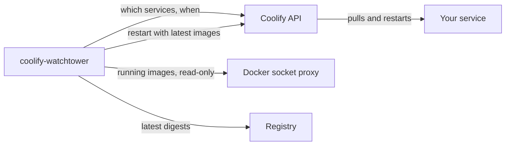

<p align="center">
  
</p>

<h1 align="center">coolify-watchtower</h1>

<p align="center">Automatic image updates for your Coolify services, carried out by Coolify itself.</p>

<p align="center">
  <a href="https://github.com/KimTholstorf/coolify-watchtower/actions/workflows/image.yml"></a>
  <a href="https://hub.docker.com/r/kimtholstorf/coolify-watchtower"></a>
</p>

coolify-watchtower checks the images of the services you choose, on a schedule you set per service. When a registry has a newer image, it asks Coolify to restart that service with the latest image. Coolify does the update, so it lands in the service's deployment history like any other deployment.

## Why not Watchtower?

[Watchtower](https://github.com/nicholas-fedor/watchtower) is the usual way to keep Docker containers up to date. Nick Fedor maintains it today, after the original containrrr project was archived. On a Coolify server, though, it replaces containers behind Coolify's back. Coolify never learns about the update, Watchtower handles single containers rather than compose stacks, and it needs write access to the Docker socket.

coolify-watchtower only reads from Docker. Every change goes through Coolify's API.

## How it works

1. You opt a service in with a scheduled task or a label, and give it a schedule.
2. When the schedule is due, coolify-watchtower compares each running image with the registry.
3. If an image changed, it asks Coolify to restart the service with the latest images. If nothing changed, it does nothing.
4. It logs the result and can notify you on Discord or ntfy.



## Quick start

### 1. Create an API token

In Coolify's settings, set **API access** to Enabled (under API and MCP). Then create a token under **Keys & Tokens → API tokens** with the `read` and `deploy` permissions. You must be an admin or owner of the team, because Coolify rejects `deploy` tokens from ordinary members.

> [!TIP]
> Turning on API access opens Coolify's API to any address with a valid token. You can limit it to coolify-watchtower with **Allowed API IPs**, next to the API access setting. coolify-watchtower talks to Coolify over Docker's `coolify` network, so find that network's address ranges on the server:
>
> ```bash
> docker network inspect coolify --format '{{range .IPAM.Config}}{{.Subnet}} {{end}}'
> ```
>
> Enter what it prints, e.g. `10.0.1.0/24, fd12:3456:789a::/64`. Include the IPv6 range if there is one, since requests can arrive over either. If you also use the API from your own machine, add its IP too.

### 2. Deploy coolify-watchtower

1. Go to **+ New Resource → Docker Compose (empty)** and paste [`docker-compose.yml`](docker-compose.yml).
2. Leave **Connect to Predefined Network** off. The compose file already connects the right container to Coolify.
3. Under **Environment Variables**, set `COOLIFY_TOKEN` to your token. Everything else has a default.
4. Deploy. After a minute or two the status should read **Running (healthy)**.

### 3. Opt a service in

Open a service you want kept up to date, go to **Scheduled Tasks → New**, and enter:

| Field | Value |
|---|---|
| Name | `watchtower` |
| Command | `true` |
| Frequency | a cron schedule such as `30 4 * * *` (every day at 04:30), or `daily`, `weekly` |
| Container | any container in the service that has `sh` |

The frequency uses cron syntax, the same as every scheduled task in Coolify, i.e. five fields for minute, hour, day of month, month and day of week. Avoid headaches and use [croncalculator.com](https://croncalculator.com/) to build one for you.

### 4. Check the logs

Open coolify-watchtower's Runtime logs and expand Updater. Within a minute you'll see your service in the table, and at the scheduled time the result of each check:

```text
coolify-watchtower 1.8.6
Settings (env = from the environment, default = built into the image):
    COOLIFY_URL            http://coolify:8080              env
    COOLIFY_TOKEN          set                              env
    DRY_RUN                false                            env
    ...
Coolify API OK (version 4.3.23)
Docker (socket proxy) OK
Opted in with a 'watchtower' task or 'coolify.watchtower' label:
    NAME                TYPE  STATUS   VIA    SCHEDULE        TIMEZONE            HEALTH  UUID
    coolify-watchtower  svc   enabled  self   daily           Europe/Copenhagen   -       udgv5xuy2niy...
    uptime-kuma         svc   enabled  task   30 4 * * *      Europe/Copenhagen   on      c92huq7by0wp...
[uptime-kuma] uptime-kuma: louislam/uptime-kuma:2 UPDATE 2.5.4 -> 2.5.5 (917318f9d7be -> c74379ac4509)
[uptime-kuma] update available (report only, no restart)
Startup report done. Waiting for schedules.
```

The settings list shows each value in effect and whether it comes from the environment (`env`) or is built into the image (`default`). The token and notification URL only show whether they're set. The check at startup only reports. Updates happen at the scheduled times. In the table, TYPE is `svc` for a service or `app` for a Docker Image application, and VIA says how it's opted in: a scheduled `task`, a `label`, or `self` for coolify-watchtower's own updates. HEALTH says whether the service's status is checked after an update.

## Opting services in

coolify-watchtower only updates services you opt in. There are two ways, and either one opts in the whole service, with all its containers.

This works for services (compose and one-click) and for **Docker Image** applications, i.e. an application deployed straight from an image such as `louislam/uptime-kuma:2`. An application uses the same scheduled task. A label goes in the application's **Container Labels** setting, since it has no compose file.

| | Coolify Scheduled Task | docker-compose label |
|---|---|---|
| Set it up in | the service's Scheduled Tasks tab | the service's compose file |
| Change the schedule | edit the task; takes effect within a minute | edit the label, then redeploy the service |
| Pause | switch the task off | set the label to `false` |
| Needs a shell in the container | yes | no |

If a service has both, the scheduled task wins.

### Coolify Scheduled Task

This is the way shown in the [quick start](#3-opt-a-service-in). On the service, go to **Scheduled Tasks → New** and create a task named `watchtower` with the command `true`. The task's frequency is the update schedule, and its on/off switch pauses updates.

The command `true` does nothing. Coolify runs it at the scheduled time in the container you pick, which is why that container needs `sh`. coolify-watchtower only reads the task's settings.

> [!TIP]
> Coolify may post "Scheduled task succeeded" to your notification channel every time it runs the task. To keep the channel quiet, turn off the success notification for scheduled tasks under **Notifications** in Coolify, and keep the one for failures.

### docker-compose label

Open the service's **Edit Compose File**, add the label to any one of its containers, and redeploy the service:

```yaml
services:
  uptime-kuma:
    image: louislam/uptime-kuma:2
    labels:
      - coolify.watchtower=30 4 * * *
```

| Label | Schedule |
|---|---|
| `coolify.watchtower=30 4 * * *` | a cron schedule, here every day at 04:30 |
| `coolify.watchtower=weekly` | one of the words below |
| `coolify.watchtower` or `coolify.watchtower=true` | the default, `daily` (set with `DEFAULT_SCHEDULE`) |
| `coolify.watchtower=false` | paused |

Docker only reads labels when it creates a container, so every change to the label needs a redeploy of the service.

### Schedules

Schedules use cron syntax, like all scheduled tasks in Coolify: five fields for minute, hour, day of month, month and day of week. Avoid headaches and use [croncalculator.com](https://croncalculator.com/) to build one for you. Coolify's words work too: `hourly`, `daily`, `weekly`, `monthly` and `yearly`, where `daily` means midnight.

Schedules run in the timezone set for the server in Coolify (**Servers → General → Server Timezone**), the same as Coolify's own scheduled tasks.

### Health checks and self-healing

coolify-watchtower watches the status Coolify shows for each opted-in service. After an update, it tells you whether the service came back healthy (see [Notifications](#notifications)). It also restarts a service that stays unhealthy or degraded. Docker restarts a container that exits, but never one that's only unhealthy, so this fills the gap.

Self-healing follows these rules:

| Rule | Why |
|---|---|
| Only `running:unhealthy` and `degraded:unhealthy` count | a stopped, paused or starting service may be that way on purpose |
| The status must stay bad for 5 minutes | one bad reading isn't enough |
| Only the failing container of a service is restarted, when Coolify can tell which | less disruption |
| It restarts without pulling new images | healing never turns into an unplanned update |
| At most 2 restarts per incident, 15 minutes apart | a crash loop gets reported to you instead |
| 3 or more services unhealthy at once: no restarts, just a warning | that usually means the server itself has a problem |
| Never while an update is being checked, a deployment is running, a container is still starting, or Coolify can't reach the server | the status can't be trusted then. Coolify shows a container in its health check's start period as healthy |
| Docker's own health check counts too | Coolify's status can lag a minute or two behind Docker's |

Both are on by default. To turn them off for one service, for example one whose status in Coolify is never green:

| Opted in with | Turn health checks off |
|---|---|
| Scheduled task | set the command to `true healthcheck=false` |
| Label | add the label `coolify.watchtower.healthcheck=false` |

`true` ignores what comes after it, so the task still succeeds. If both are set, the task's command wins.

### Old names

Earlier versions used the task name `auto-update` and the label `coolify.auto-update`. Both still work. The log and the update notifications remind you to rename them.

## Settings

Only `COOLIFY_TOKEN` is required. `NOTIFY_URL` is highly recommended, unless you prefer keeping tabs on things via Coolify Runtime logs.

| Variable | Default | What it does |
|---|---|---|
| `COOLIFY_TOKEN` | | API token with `read` and `deploy` |
| `NOTIFY_URL` | | Discord webhook or ntfy topic to notify, see [Notifications](#notifications) |
| `DRY_RUN` | `false` | `true` reports available updates without restarting anything |
| `SELF_UPDATE` | `daily` | when coolify-watchtower updates itself: a schedule, or `false` |
| `TZ` | | leave empty to use each server's timezone from Coolify, or set one timezone for everything |
| `COOLIFY_URL` | `http://coolify:8080` | Coolify's API address |
| `DEFAULT_SCHEDULE` | `daily` | schedule used when a label is set to `true` |
| `REPORT_ON_START` | `true` | check all opted-in services once at startup, report only |

### Advanced settings

These aren't in the compose file. To use one, add it to the updater's `environment:` in **Edit Compose File**.

| Variable | Default | What it does |
|---|---|---|
| `TASK_NAME` | `watchtower` | an extra scheduled task name that opts a service in |
| `AUTO_UPDATE_LABEL` | `coolify.watchtower` | an extra label name that opts a service in |
| `AUTO_HEAL` | `true` | `false` turns self-healing off for everything |
| `HEAL_AFTER` | `5` | minutes a service must stay unhealthy before the first restart |
| `HEAL_RETRY_AFTER` | `15` | minutes to wait after a restart before trying again |
| `HEAL_MAX_RESTARTS` | `2` | restarts per incident before giving up until the service is healthy again |
| `HEAL_OUTAGE_THRESHOLD` | `3` | services unhealthy at the same time that count as a server problem (no restarts) |

The standard names `watchtower` and `coolify.watchtower`, and the old ones, keep working either way.

## Notifications

Set `NOTIFY_URL` and you get a message when an update is started, when a restart fails (with Coolify's reason), and, in dry-run mode, when an update is available.

```text
coolify-watchtower: updating uptime-kuma
louislam/uptime-kuma:2 2.5.4 -> 2.5.5
```

You also get a message when the list of opted-in services changes: one is added or removed, its schedule changes, or it's paused or resumed. coolify-watchtower waits until a change has held for a minute, so a service restarting doesn't count as removed and added again.

```text
coolify-watchtower: opt-ins changed
+ uptime-kuma (service): 30 4 * * * Europe/Copenhagen, via task
~ rejseliv.app: schedule */5 * * * * -> daily
- old-app (application): no longer opted in
```

After each update, coolify-watchtower keeps an eye on the service's status in Coolify. You get one more message: healthy once it has been running without a failing health check for two checks in a row, or unhealthy if that hasn't happened within 10 minutes. There's no automatic rollback, so the warning tells you when to step in. Services without a health check of their own can only be reported as running.

Self-healing sends a message when it restarts something, when a service recovers, and when it gives up:

```text
coolify-watchtower: ⚠ immich unhealthy, restarting
Coolify status: running:unhealthy for 5 min
Restarting immich-server (attempt 1 of 2).
```

```text
coolify-watchtower: ⚠ uptime-kuma looks unhealthy after the update
Coolify status after 10 min: running:unhealthy
louislam/uptime-kuma:2 2.5.4 -> 2.5.5
```

- **Discord:** create a webhook in the channel (**Channel settings → Integrations → Webhooks**) and use its URL. Coolify's API can't post to the Discord channel you set up inside Coolify, so coolify-watchtower needs its own webhook.
- **ntfy:** use the topic URL, e.g. `https://ntfy.sh/my-topic`.
- **Anything else:** coolify-watchtower sends a plain-text POST with the title in a `Title` header.

<!-- screenshot: a Discord notification -->

Versions such as `2.5.4 -> 2.5.5` come from the registry's tags. When no version tag matches an image, the message shows short digests instead.

## Keeping coolify-watchtower up to date

coolify-watchtower updates itself on the `SELF_UPDATE` schedule, daily by default. When other services are due at the same time, it restarts itself last. You can also update it any time with **Pull Latest Images & Restart**.

Both update only the image. Coolify keeps the compose file you pasted and never replaces it, so this project keeps its compose file stable and puts changes in the image. If a release ever needs a new compose file, its release notes say so, and you paste the new one under **Edit Compose File**.

After pasting a new compose file, check the resource's **Environment Variables** tab. Coolify keeps variables the old file created, even when the new one no longer uses them, and still passes them to the container. Delete any that aren't in the new file, then restart. The startup log warns you about known leftovers.

The image is published in two places:

| Registry | Image |
|---|---|
| GitHub | `ghcr.io/kimtholstorf/coolify-watchtower` (used by `docker-compose.yml`) |
| Docker Hub | `kimtholstorf/coolify-watchtower` |

Both carry the same images: `latest` is always the newest release, and version tags such as `1.6.1`, `1.6` and `1` pin a release. To pull from Docker Hub instead, paste [`docker-compose.dockerhub.yml`](docker-compose.dockerhub.yml) rather than `docker-compose.yml`. The two are identical apart from the image line.

## Security

- Docker access goes through [docker-socket-proxy](https://github.com/Tecnativa/docker-socket-proxy) with read-only access to containers and images. coolify-watchtower can't start, stop or change anything in Docker itself.
- Only the updater joins Coolify's `coolify` network. The socket proxy stays on its own private network, because read-only access still exposes every container's environment variables. That's why **Connect to Predefined Network** must stay off: it would put the proxy on the shared network.
- The token needs `read` and `deploy`. It doesn't need `write`, `read:sensitive` or root.
- If you limit **Allowed API IPs** in Coolify, add the subnet of the `coolify` network. `docker network inspect coolify` shows it.

## Limits

- Services and Docker Image applications are supported. Applications built from Git, a Dockerfile or a compose file are listed in the log and otherwise ignored, because deploying them means a full rebuild.
- Only public registries, such as Docker Hub and ghcr.io.
- Images pinned by digest and locally built images are skipped.
- Coolify restarts a service without a rolling update, so expect a short outage. Docker Image applications get a rolling update. There is no automatic rollback.
- Month and day names in cron (`JAN`, `MON`) aren't supported.

## Troubleshooting

| You see | Cause and fix |
|---|---|
| `HTTP 403 {'message': 'Missing required permissions: read'}` | The token lacks a permission. Create one with both `read` and `deploy`. |
| `FAILED` notification with `HTTP 403` on restart | The token lacks `deploy`, or its owner isn't a team admin or owner. |
| `cannot reach Coolify API: HTTP 403` with a valid token | **Allowed API IPs** doesn't include the `coolify` network's subnet. |
| `no running containers found for uuid ...` | The service isn't running, or its containers couldn't be matched to it. Please open an issue with the output of `docker inspect` for one of its containers. |
| `WARN unsupported schedule` | The schedule isn't valid cron or one of the supported words. |
| **Running (no healthcheck)** in Coolify | Your compose file predates the health checks. Paste the current [`docker-compose.yml`](docker-compose.yml). |
| "No logs yet" right after deploying | coolify-watchtower waits for the socket proxy to report healthy first. Give it a minute. |

## Building from source

To have Coolify build the image from this repository instead, add it as a Git resource (for example through the [GitHub App source](https://coolify.io/docs/applications/sources/github/app)), choose the **Docker Compose** build pack and set **Docker Compose Location** to `/docker-compose.build.yml`. Coolify treats that as an application, so self-update doesn't apply; redeploy to update.

Tests run offline with `python3 tests/test_updater.py`.

---

<sub>MIT licensed, see [LICENSE](LICENSE). coolify-watchtower isn't based on Watchtower and isn't affiliated with Coolify or Watchtower.</sub>
